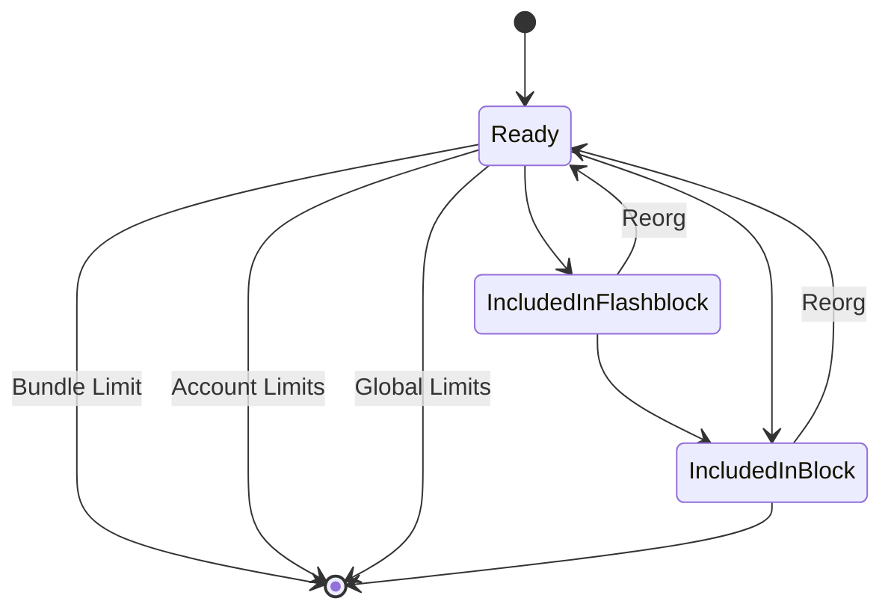

### Bundle State Management

_(this maybe extended to include a NonReady category for nonce gapped transactions etc.)_

The builder will load all `READY` transactions, which have a high enough minimum base fee
and are valid for the current block that is being built.

### Dropping Transactions
Transactions can be dropped because of multiple reasons, all of which are indicated on 
the audit log for a transaction. The initial prototype has the following limits:

- Bundle Limits
  - Timeouts (block or flashblock)
  - Block number 
- Account Limits
  - An account can only have a fixed number (TBD) of transactions in the mempool, 
    transactions will be dropped by descending nonce
- Global Limits
  - When the mempool reaches a certain size (TBD), it will be pruned based on a combination of:
    - Bundle age
    - Low base fee

### Maintenance Job
The limit enforcement and inclusion detection is managed by the maintenance job in 
[`crates/maintenance`](https://github.com/base/tips/tree/master/crates/maintenance). It's designed to be idempotent so 
that multiple jobs can execute concurrently. As this adds additional load to the BundleStore, it's preferable 
to run a low number.