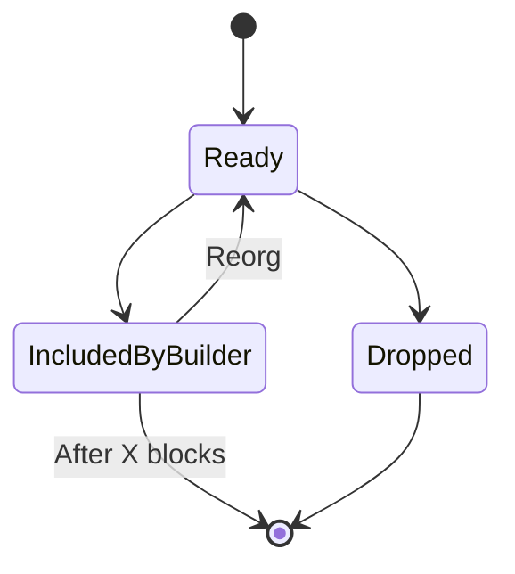

# Bundle States

## States

_(this maybe extended to include a NonReady category for nonce gapped transactions etc.)_

The builder will load all `READY` transactions, which have a high enough minimum base fee
and are valid for the current block that is being built.

## Bundle Events

In addition to the states above,

- **Received**:
  - Received bundle event
  - Arguments: (uuid)
- **Created**:
  - Initial bundle creation with transaction list
  - Arguments: (bundle)
- **Updated**:
  - Bundle modification (transaction additions/removals)
  - Arguments: (bundle)
- **Cancelled**:
  - Bundle explicitly cancelled
  - Arguments: (nonce | uuid)
- **IncludedByBuilder**:
  - Bundle included by builder in flashblock
  - Arguments: (flashblockNum, blockNum, builderId)
- **IncludedInFlashblock**:
  - Flashblock containing bundle included in chain
  - Arguments: (flashblockNum, blockNum)
- **IncludedInBlock**:
  - Final confirmation in blockchain
  - Arguments: (blockNum, blockHash)
- **Dropped**:
  - Bundle dropped from processing
  - Arguments: Why(enum Reason)
    - "TIMEOUT": Bundle expired without inclusion
    - "INCLUDED_BY_OTHER": Another bundle caused the transactions in this bundle to not be includable

### Dropping Transactions
Transactions can be dropped because of multiple reasons, all of which are indicated on 
the audit log for a transaction. The initial prototype has the following limits:

- Included by other
  - There are two bundles that overlap (e.g. bundleA=(txA, txB) and bundleB=(txA), if bundleB is included and txA in
    bundleA is not allowed to be dropped, then bundleA will be marked as "Included By Other" and dropped.
- Bundle Limits
  - Timeouts (block or flashblock)
  - Block number 
- Account Limits
  - An account can only have a fixed number (TBD) of transactions in the mempool, 
    transactions will be dropped by descending nonce
- Global Limits
  - When the mempool reaches a certain size (TBD), it will be pruned based on a combination of:
    - Bundle age
    - Low base fee

### Maintenance Job
The limit enforcement and inclusion detection is managed by the maintenance job in 
[`crates/maintenance`](https://github.com/base/tips/tree/master/crates/maintenance). It's designed to be idempotent so 
that multiple jobs can execute concurrently. As this adds additional load to the BundleStore, it's preferable 
to run a low number.